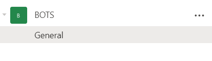

# Introduction

It can be overwhelming when trying to set-up or develop a monitoring system for your data-pipelining / processing jobs. However, it _is_ an important aspect of any recurring or scheduled data-pipeline.

Ideally, your process can be broken down into single steps. Commonly, they can be broken down into Extraction steps (pulling down or reading in data), Transformation steps (pre-processing or manipulations of the data for the desired output), and Load steps (loading the now processed data into a database, or  exporting flat files to a shared folder).

These steps may all be in a single script when you start designing a process, but as your pipelines grow and complexity increases, it will be far easier to navigate separate files for each step in the process.

There are three methods I recommend to get started (in the following order):

- Audio Notifications
- Log files
- Message Notifications

# Audio Notifications

There is a great package in *R* called [beepr](https://cran.r-project.org/web/packages/beepr/beepr.pdf) that can be utilized to send sound notifications through your computer. This is helpful when first creating a long data-processing script that you are still developing.

Instead of repeatedly checking if a process is done, you can utilize *beepr* and be notified by one of their many great sounds. My personal favorite is the recognizable "fanfare" theme, it is just long enough for me to hear it if I am concentrating on something else.

```{r, eval=FALSE}
# if you need to install the package from CRAN
# install.packages('beepr')

for(i in 1:10){
  print(i)
  Sys.sleep(2)
}

beepr::beep(3) # for the fanfare theme
```

# Log files

Log files are a method to record a history of your data-pipeline process.

You may have seen individuals do this by hand, by opening a file, writing out text, inserting a new line, then closing the file:

```{r, eval=FALSE}
# simulate some data
test_data <- as.data.frame(list(x=rnorm(100)))

# open a connection to the log file
log_file <- file("log.txt")

# write notification
write(paste0('There are ', nrow(test_data), ' rows of data'), log_file, append = TRUE)

# close the connection
close(log_file)
```

I prefer to use the package [log4r](https://cran.r-project.org/web/packages/log4r/log4r.pdf). It can be extended to log activity to the console, or a flat file, time stamps are created by default, and specific logging levels can be set for each output. For example, only `WARN` level logs are written to the console, while both `INFO` and `WARN` levels logs are written to a  file.

Below is a toy example of how I use *log4r* and [glue](https://cran.r-project.org/web/packages/glue/glue.pdf) (an incredible package that can evaluate `R` code in a text string) to log pipelines:

```{r, eval=FALSE}
# install log4r if necessary
# install.packages('log4r')
# install glue if necessary
# install.packages('glue)
library(log4r)

# create a logfile that is a plain text document
log <- logger(appenders = file_appender('logfile.log'))

# simulate some data
test_data <- as.data.frame(list(x=rnorm(100)))

# write out the log information, at the appropriate level
info(log, glue::glue("There are {nrow(test_data)} rows of data."))

```


# Message Notifications

The previous methods outlined work well for the one designing the pipeline to receive feedback on their data-pipeline process. However, other members of your unit or organization would often benefit from having visibility into the data-pipeline process. I have found one of the easiest ways to implement a messaging system to other users, is to utilize existing familiar communication channels.

Previously we have used [Slack](https://slack.com/), but recently transitioned to [Teams](https://www.microsoft.com/en-us/microsoft-365/microsoft-teams/group-chat-software) by Microsoft. There are packages for `R` that you can utilize to connect to either your organization's *Slack* instance ([slackr](https://github.com/hrbrmstr/slackr)) or Microsoft Teams ([teamr](https://github.com/wwwjk366/teamr)).

For Microsoft Teams, there are a few steps to get started:

1. [Create a Team](https://support.microsoft.com/en-us/office/create-a-team-from-scratch-174adf5f-846b-4780-b765-de1a0a737e2b) that will receive the notifications for this data-pipeline, or use an existing team. In this example I use the Team *BOTS*.



2. [Connect the webhook](https://docs.microsoft.com/en-us/microsoftteams/platform/webhooks-and-connectors/how-to/add-incoming-webhook) to the Team created in step 1. This is done by clicking the three dots `...` in one of the Team channels, then selecting *connectors*. From the list, select the *Incoming Webhook* connector to add to your channel.


3. Configure the Webhook Connector by clicking the *Configure* button once it has been added. Give your connector a name, and upload an image if desired. in my example I named my connector *BOT*. After the connector has been created, you should be able to copy the Webhook Connector URL for this connector. Copy this URL to use later in your scripts.


Below is an example of a notification function I send after data is downloaded from our Salesforce instance in a data-pipeline that updates our website:

```{r, eval=FALSE}
# install the teamr package if necessary
# install.packages('teamr')
# install glue if necessary

library(teamr)

# set your organization's web-hook
cc <- connector_card$new(hookurl = "HOOK URL FROM STEP 3")

# define a message function
teams_message <- function(title, text, color = "#00800"){
  cc$text(text)
  cc$title(title)
  cc$color(color)
  cc$send()
}

# post the message to the channel
teams_message( text = glue::glue('Update: Salesforce Download Complete. {length(skipped_objects)} skipped.')
              ,title = 'Website Refresh:')

```

The result is the following message posted in the *BOTS* channel, from my connecter *BOT*:


# Conclusion

We covered three main methods of notifying a user at the end of major steps of a data-pipeline process. The first method is recommended for long-running processes that you are actively developing. The second method is recommended for processes that are recurring or scheduled, that you wish to record a history of. The second *and* third methods are recommended for those data-pipeline processes that require more visibility than just the developer maintaining the process. At the end of each step, a method to provide feedback to those that monitor the data-pipeline can save you from missing a misbehaving pipeline for several days, and ensure that the integrity of the process.

